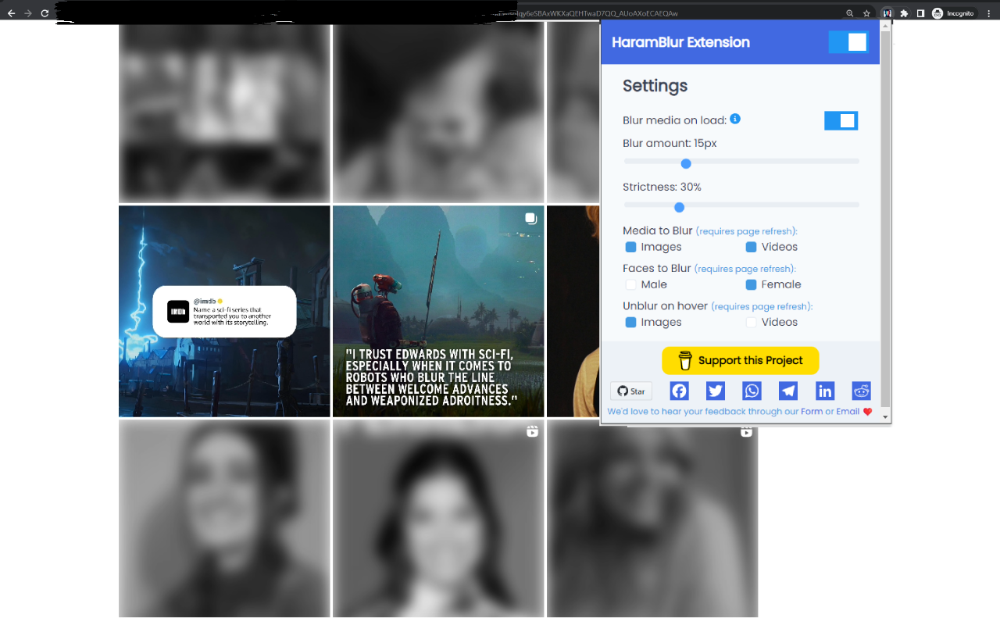

# HaramBlur Extension

HaramBlur is a browser extension that allows you to navigate the web with respect for your Islamic values, privacy and reduce browsing distractions.

HaramBlur utilizes face detection and NSFW content detection and provides controls that allow you to uphold the Islamic gaze protection principle and tailor your online experience by automatically blurring images and videos that contain unwanted or impermissible content.

You can configure the type of detection you want and the amount of blur, the level of strictness, hover to unblur, choose a specific gender to blur, or turn the extension on and off via the interactive pop-up 😄



## Features

- Works on images and videos that contain unwanted or impermissible content
- Works on most (if not all) websites and social media platforms
- Configurable detection settings to tailor your browsing experience
- Interactive pop-up for easy on/off toggling
- Customizable hover to unblur feature
- Decent speed and accuracy (continously improved)

## How it Works

HaramBlur currently used face detection and recognition features provided by [Human library](https://github.com/vladmandic/human) to detect faces and blur them based on the user settings and preferences. It also uses NSFW detection provided by [nsfwjs](https://github.com/infinitered/nsfwjs/) to further improve the accuracy. You can configure the type of detection you want and the amount of blur, hover to unblur, or turn the extension on and off via the interactive pop-up.

# Installation Guide

## Option 1: Using the Plugin from the extensions store

1. Visit the [Haramblur extension on the Chrome Web Store](https://chrome.google.com/webstore/detail/haramblur/pbcoegikffnadpahojjhgdladmmddeji) or the [Firefox Add-ons Store](https://addons.mozilla.org/addon/haramblur/)

2. Follow the installation instructions on the page.

## Option 2: Compiling it On Your Own

If you want to compile the extension on your own, follow these steps:

### Step 1: Clone the Repository

Clone the HaramBlur repository to your local machine:

#### Chromium
```bash
git clone https://github.com/alganzory/HaramBlur.git
```

### Firefox

```bash
git clone -b firefox-main --single-branch https://github.com/alganzory/HaramBlur.git
```

### Step 2: Install Dependencies

Navigate to the project directory and install the necessary dependencies:

```bash
npm install
```

### Step 3: Code Your Magic

Make the necessary modifications or enhancements to the code.

### Step 4: Build the Extension

- Build the extension by running:
  ```bash
  npm run build
  ```

### Step 5: Generate a Release (Optional)

Generate a release zip file to be uploaded to the browser/store:

```bash
npm run release
```

### Load the extension in Chromium browsers
  - Go to `chrome://extensions/`.
  - Enable "Developer mode".
  - Click "Load unpacked" and select the project folder.

### Load the extension in Firefox
- Go to `about:addons`
- Press the gear icon.
- Click "Install Add-on from file"
- Select the zip file that you generated in Step 5.


## Improvements

Here are some planned improvements that could be made to HaramBlur:

- Support for more browsers
- Improve the speed of detection
- Improve the accuracy of NSFW detection to reduce false positives and negatives
- Make the extension more Shariah-compliant by adding additional privacy controls and customization options

## Open Source

HaramBlur is an open-source project and I really appreciate any contributions. Feel free to open an issue or submit a pull request if you have any suggestions or improvements you would like to see.

## Like the project?

If you like the project, please consider giving it a star ⭐️. If you wanna further support me, [buy me a coffee ☕️](https://www.buymeacoffee.com/alganzory), thank you! 😊

Don't forget us from your Du'a! 🤲
